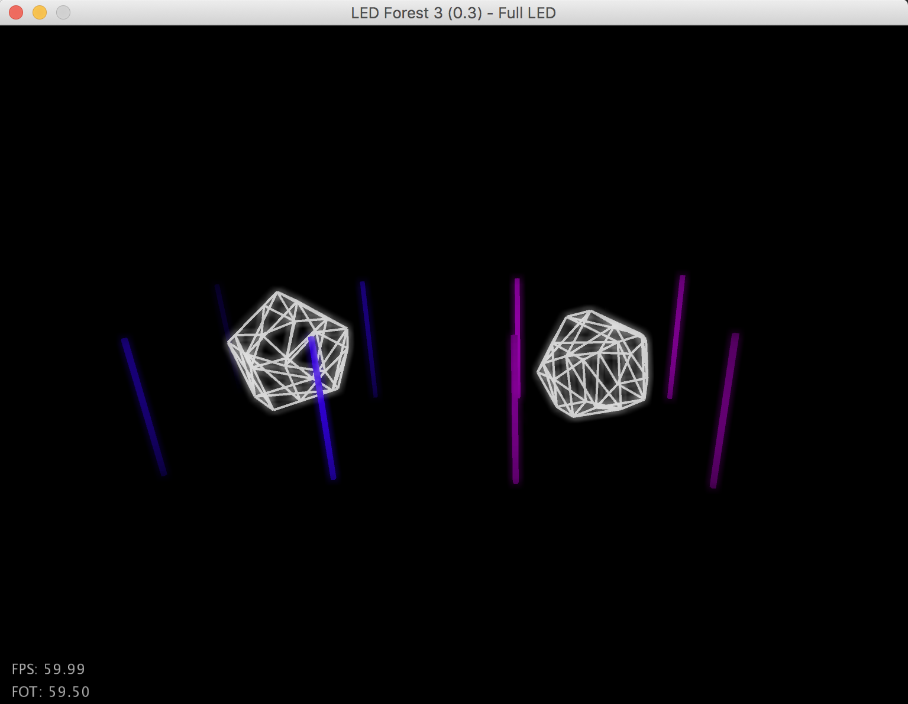

# LED Forest 3 [](https://travis-ci.org/bildspur/led-forest3)
Version 3 of the LED light installation which looks like a forest.




### Installation and Usage

```bash
# windows
gradlew.bat run

# macos / linux
./gradlew run
```

#### MacOS Silicon
On MacOS Silicon it is recommended to use Eclipse Temurin (AdoptOpenJDK) 17.0.2 (Intel) and run it under Rosetta2.
